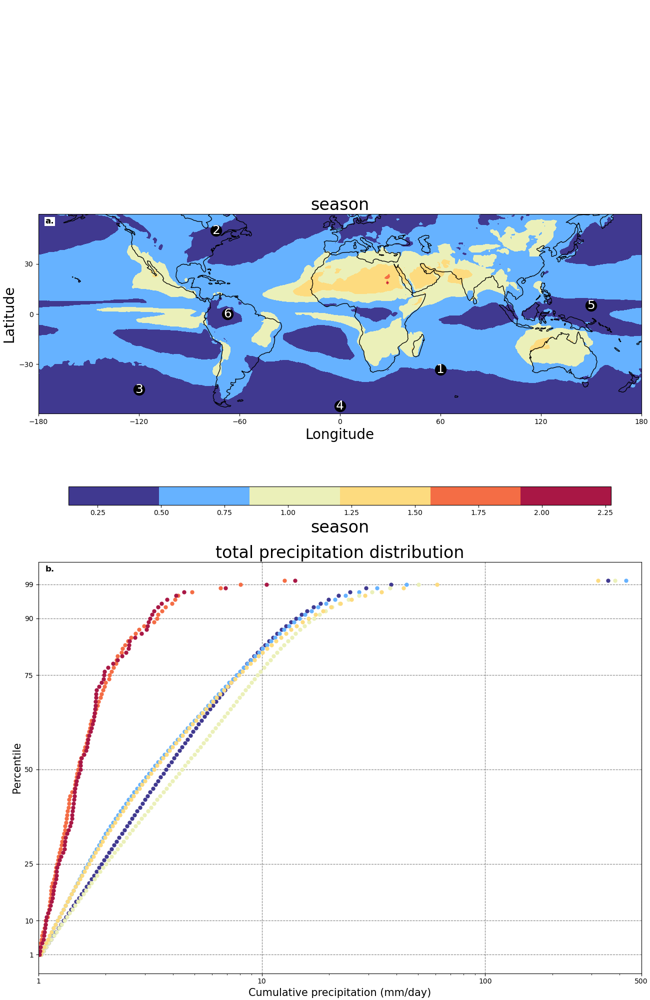
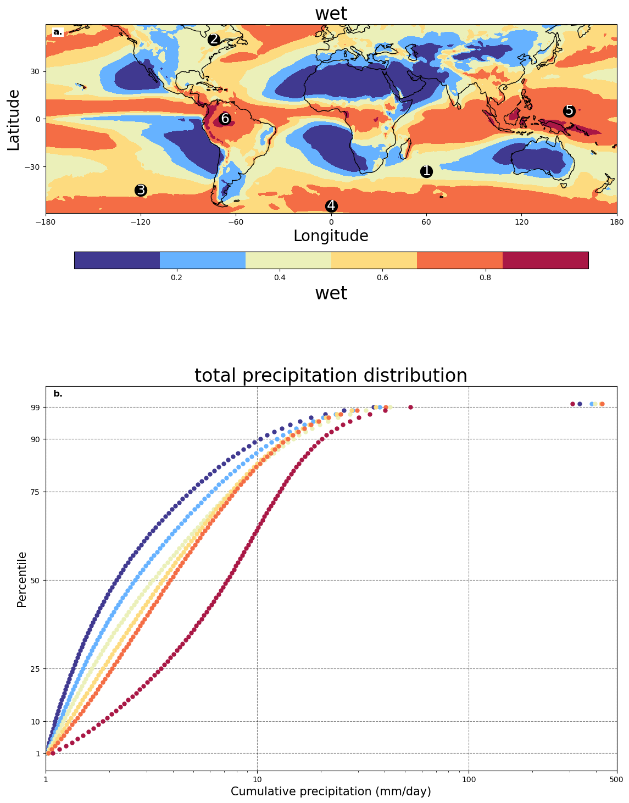

### 解释
1. **数据重采样**：
    将日数据转换为月数据。

2. **计算每年的季节性指数**：
   - 计算公式为：
     $$SI = \frac{1}{P_{total}} \sum_{i=1}^{12} \left| P_i - \frac{P_{total}}{12} \right|$$
   - 其中，$P_i$ 是第$i$个月的降水量，$P_{total}$ 是年降水总量。

3. **按年分组并计算季节性指数**：
4. **求多年的季节性指数的平均**：
5. **输出**：
   - 函数返回每个格点的平均季节性指数。 

The Seasonality Index (- **中低纬度区别明显**SI) (Walsh and Lawler, 1981)




```python
# 然后再次使用 main_month 函数
from AdaptiveWorkflow_duration import main_process


```


```python
start_parm = {
    'var': 'wet',
    'renew': '010',
    'data_set': 'era5',
    'return_point': 'percentile_show'
}
main_process(**start_parm)
```

    max_frequency:0.9997262358665466
    min_frequency:0.0003422313602641225
    area_num: 0
    area_num: 1
    area_num: 2
    area_num: 3
    area_num: 4
    area_num: 5
    

    F:\liusch\remote_project\climate_new\Graphics_Wdp.py:159: UserWarning: The figure layout has changed to tight
      fig.tight_layout()
    

    per:0 time:0.33237507939338684
    per:1 time:0.4722108244895935
    per:2 time:0.6268993616104126
    per:3 time:0.6442162990570068
    per:4 time:0.8894592523574829
    per:5 time:0.4500342309474945
    


.\fig\wet_era5\/<br>
&nbsp;&nbsp;<a href='./fig/wet_era5//distribution.png' target='_blank'>distribution.png</a><br>


    

    


# 获取变量的data_frequency矩阵和percentile


```python
start_parm = {
    'var': 'wet',
    'renew': '010',
    'data_set': 'era5',
    'return_point': 'percentile_show'
}
var_values = ['wet', 'season', 'duration']

for var_value in var_values:
    start_parm['var'] = var_value
    main_process(**start_parm)
```

    max_frequency:0.9997262358665466
    min_frequency:0.0003422313602641225
    area_num: 0
    area_num: 1
    area_num: 2
    area_num: 3
    area_num: 4
    area_num: 5
    per:0 time:0.33237507939338684
    per:1 time:0.4722108244895935
    per:2 time:0.6268993616104126
    per:3 time:0.6442162990570068
    per:4 time:0.8894592523574829
    per:5 time:0.4500342309474945
    

    F:\liusch\remote_project\climate_new\Graphics_Wdp.py:217: UserWarning: This figure was using a layout engine that is incompatible with subplots_adjust and/or tight_layout; not calling subplots_adjust.
      plt.subplots_adjust(left=0.05, right=0.85)
    


.\fig\wet_era5\/<br>
&nbsp;&nbsp;<a href='./fig/wet_era5//distribution.png' target='_blank'>distribution.png</a><br>


    max_frequency:2.2723283767700195
    min_frequency:0.1356859654188156
    area_num: 0
    area_num: 1
    area_num: 2
    area_num: 3
    area_num: 4
    area_num: 5
    per:0 time:0.3873821496963501
    per:1 time:0.38828718662261963
    per:2 time:0.23078930377960205
    per:3 time:0.18554924428462982
    per:4 time:0.2758709192276001
    per:5 time:0.7330954074859619
    

    F:\liusch\remote_project\climate_new\Graphics_Wdp.py:217: UserWarning: This figure was using a layout engine that is incompatible with subplots_adjust and/or tight_layout; not calling subplots_adjust.
      plt.subplots_adjust(left=0.05, right=0.85)
    


.\fig\season_era5\/<br>
&nbsp;&nbsp;<a href='./fig/season_era5//distribution.png' target='_blank'>distribution.png</a><br>


    max_frequency:14.757575757575758
    min_frequency:1.3714017521902377
    area_num: 0
    area_num: 1
    area_num: 2
    area_num: 3
    area_num: 4
    area_num: 5
    per:0 time:0.2759092552514042
    per:1 time:0.3274828097064615
    per:2 time:0.1609025469667913
    per:3 time:0.1729812085543483
    per:4 time:0.3170775567921845
    per:5 time:0.48552528025661473
    

    F:\liusch\remote_project\climate_new\Graphics_Wdp.py:217: UserWarning: This figure was using a layout engine that is incompatible with subplots_adjust and/or tight_layout; not calling subplots_adjust.
      plt.subplots_adjust(left=0.05, right=0.85)
    


.\fig\duration_era5\/<br>
&nbsp;&nbsp;<a href='./fig/duration_era5//distribution.png' target='_blank'>distribution.png</a><br>


# 变量的地理相关性
### 最大最小值归一化
### 坐标调整到0,0开始


```python
from Graphic_multi_correlation import depart_ml_lat
key_list=['wet', 'season', 'duration']
key_limit={
    'wet':(0.6,1.0),
    'season':(0.02,0.32),
    'duration':(0.14,0.36)
}
depart_ml_lat(key_list,key_limit)
```


```python

```
